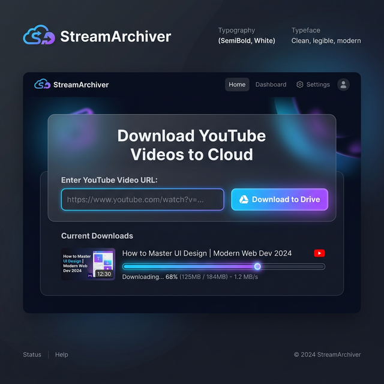

<div align="center">

# 🚀 StreamArchiver: YouTube to Cloud Downloader

[](https://colab.research.google.com/github/lakshan-bandara/YouTube-to-Cloud-Downloader/blob/main/StreamArchiver.ipynb)
[](LICENSE)
[](https://python.org)

**StreamArchiver** is a professional-grade Google Colab tool designed to download high-quality YouTube videos and audio directly to your Google Drive. No software installation required—everything runs in the cloud.

---

## 📸 Preview



---

</div>

## ✨ Features

- 📹 **High-Resolution Downloads**: Support for 720p, 1080p, 1440p, and even 4K.
- 🎵 **Audio Extraction**: Easily convert videos to high-quality MP3 format.
- ☁️ **Cloud Integration**: Direct-to-Drive saving for easy access anywhere.
- 🎨 **Premium UI**: Clean, user-friendly interface using Google Colab Forms.
- ⚙️ **Powered by yt-dlp**: The most reliable and fastest download engine.

---

## 🛠️ How to Use

1.  **Open the Notebook**: Click the "Run on Google Colab" badge at the top.
2.  **Mount Drive**: Run the first cell to connect your Google Drive account.
3.  **Configure**:
    *   Paste the **YouTube URL**.
    *   Set **Save To** (Google Drive or Local PC).
    *   Set your preferred **Output Path** (default is `/StreamArchiver`).
    *   Select **Format** (Video or Audio).
    *   Choose the **Resolution**.
4.  **Execute**: Click the play button, and wait for the "Success" message!

---

## 🚀 Installation (Local - Optional)

If you wish to run this locally, ensure you have Python and FFmpeg installed:

```bash
pip install yt-dlp
```

Usage:
```bash
yt-dlp -f "bestvideo+bestaudio" "https://www.youtube.com/watch?v=example"
```

---

<div align="center">

## 👨‍💻 Developed By

Developed with ❤️ by **Lakshan**.

> [!TIP]
> Need a custom tool or have questions? Reach out via WhatsApp!

[](https://wa.me/94768855659)

---

## 📜 License

This project is licensed under the MIT License - see the [LICENSE](LICENSE) file for details.

---

<b>StreamArchiver © 2024</b>

</div>
